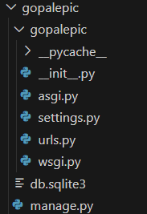

It is always preferred to run virtual envirnoments with python

We will be using uv , it is like npm

install uv using 

powershell -c "irm https://astral.sh/uv/install.ps1 | iex"

in windos to make the virtual environment

uv venv

Now to activate virtual envirnment

.venv\Scripts\activate

Now installing django in virtual envirnoment

uv pip install Django

Now we have to start out project with django 

django-admin startproject [Project_Name]

RUnnning the django server 

python manage.py runserver 

after running this command , the default port is 8000 , it you want different port 

python manage.py runserver 8001

Now lets move to the project file 

which is gopalepic 
you also find your project file name into the directory also 

after opening the folder you can se some bunch of files

<Settings.py ------>

It has all the sercret keys , middlewares ,templeter , Databases , Authentications , ect...

<Urls.py-------->

Routing , routing can be done in urls
by default django provide admin platform

 
How the whole req res happens in django

USER => req => urls.py => Views.py =
        res<========================

