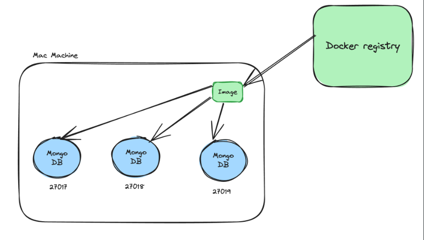
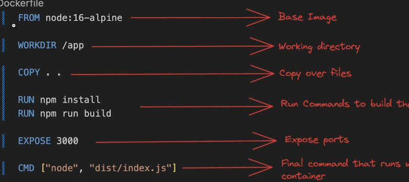
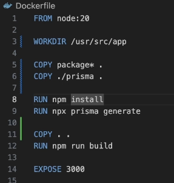
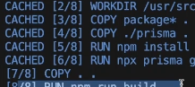
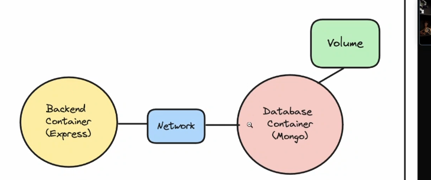
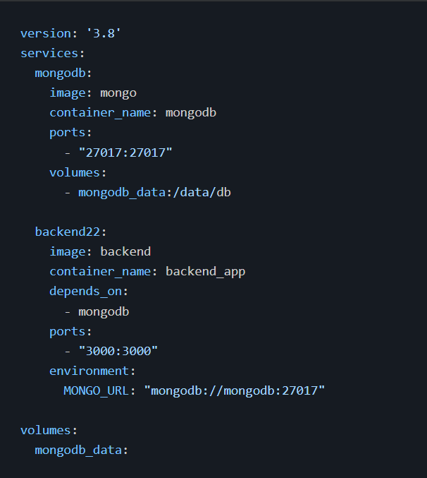

# Why Docker

1) Kubernetes orchestration 

2) Running processes in isolated environments

3) easy to run projects locally

# Containerization

 Containers are a way to package and distribute software applications in a way that makes them easy to deploy and run consistently across differnet envirnoments.

 Allow you to package an application

 # 3 Technologies to comfortable with 
 1) Docker Engine
 2) Docker CLI
 3) Docker registry

 # Docker Engine
 
 It is a Containerization Technology that allows develoeprs to package applications into containers

 Containers ==> Standard executable components combnining application CODE with OS libraries and DEPENDENCIES requried to run that code in any envirnment

 # Docker CLI
  Command Line Interface

 # Docker Registry

 Place where Images are stored 

 images => contains code like mongoImage , postgresImage

 # images VS containers

 1) Image
 Docker image is a lightweight , standalone , executable package that includes exerything needed to run a piece of software , including the code , a runtime libraries , environment variables and config files.

   Example => codebases on github

2) Container
 Container is a running instance of an image. 
 Runs in an isolated envirnment

 Example => Running that github codebase locally on you computer

 

# Docker Commands

docker images

docker ps 

docker run

docker build => to make our own docker image

# Docker File 
If you want to create an image from your own code , that you can push to dockerhub,
you need to create a DockerFile for you application

DockerFile is a text document that contains all the commands a user could call on the command line to create an image

# Explaing docker the steps to run an file

# Optimise Docker file 

Optimising a dockerFile command is a necessary step 

Whenever a DockerFile run the commands

 It caches the data like 
{
        [+] Building 2.7s (9/13)                            docker:default
 => [internal] load build definition from Dockerfile          0.0s
 => => transferring dockerfile: 238B                          0.0s 
 => [internal] load metadata for docker.io/library/node:20    2.4s 
 => [auth] library/node:pull token for registry-1.docker.io   0.0s
 => [internal] load .dockerignore                             0.0s
 => => transferring context: 2B                               0.0s 
 => CACHED [1/8] FROM docker.io/library/node:20@sha256:d3c8a  0.0s 
 => [internal] load build context                             0.1s 
 => => transferring context: 238B                             0.1s 
 => [2/8] WORKDIR /usr/src/app                                0.1s 
 => CACHED [3/8] COPY package* . 
 }

## above text is the some text from the terminals 

Here u can see , Docker chaches the data ,and then process the steps 

as a GOOD DEVELOPER , we wanted to minimise the chaches 

Whenever the docker file see any changes in the code , it just again changes the data .... 

to we Always Optimise a dockerFIle 

The above image tells that 

if the package.json file changes , then on the npm install command will one 

and 
if and one if the primsa file will change , then only the npx prisma generate file will run

On changes only and only the index.ts file , six of the commands are not running agian , they are already cached 

on 7&8 commands are again running 

 ####  Each line of the dockerFile code is know as LAYERS

# Networks and Volumes 

both are concepts that become important when running multiple containers running in which you 

1) Need to persist data across docker restarts
2) Need to allow containers to talk to each other

## Volumes

A volume is gernally preferred to made because on losing connection with the database , the data on databse may not persist , but volume does...

### creation of a volume 

1)            docker volume create VOL1

### Mount the folder in ongo which actually stores the data in this volume 

1)           docker run -v VOL1:/data/db -p 27017:27017 mongo

## Networks 

Powerful feature that allows contaienrs to commnunicate with each other and with the outside world .
localhost on a docker container means it's own network and not the network of the host machine 

## Building a network

## building the image

1)      docker build -t image_tag .

1)          docker network create myNetworkMongo

## starting backend process along with network

3)          docker run -d -p 3000:3000 -- name backend --network my_network image_tag

## startng mongo along with netwoek and volume attached 

 4)           docker run -d -v volume_database:/data/db --name mongo --network my_custom_network -p 27017:27017 mongo

# Few more docker commands 

## Wanted to executes some commands inside the docker container 

Commans to get inside the docker container

1)              docker exec -it <ContainerID> /bin/bash

# Pushing Images to dockerHub 

# Docker Compose

Docker compose is a tool designed to help you define and run multi=container dockr applications , 
With composr , you use a YAML fileto configure your application's serevices,
networks,and volumes. then,  with a single commands you can create and start all the service from your configuration

## if we are not using docker compose 

** Create a network 

1)           docker network create myNetwork

** create a Volume

2)          docker volume create myVolume

** Start mongo container 
3)         docker run -d -v volume_database:/data/db --name mongo --network mycustom_newtwork  mongo

** Start mongo container
4)          docker run -d -p 3000:3000 --name backend --network my_custom_newtork backend

After docker-compose

We will be writing some code to the .yaml file , that describes all your containers and volumes 

## Example of Yaml file 

## Starting the composr 

docker-composr up

## Stopping the compose 

docker-compost down --volumes