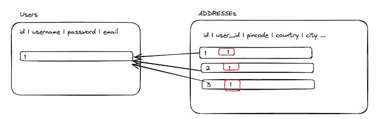

<NoSQL> database
  store data in schema less fashion,Extemenly fast

  eg: MongoDB

  <SQL> database
   store data in form of rows and columns
   
   eg: MySQL , Postgres

<Why SQL>
  1) SQL databases have a strict schema 
  2) Data follows the schema
   

  <Create a Database>

    set up a Postgres database

      can be done with
        1) Using neondb{ https://neon.tech/ }

        2)Using docker 

    We will be using neonDb 

  <Libraries> that lets you connect and put data 

  1) psql {terminal based front-end to PostgreSQL}
  2) pg {Node.js library , used in backend }

  

  <Postgres Commands>

     CREATE TABLE users(
        id SERIAL PRIMARY KEY,
        username VARCHAR(50) UNIQUE NOT NULL ,
        email VARCHAR(50) UNIQUE NOT NULL , 
        password VARCHAR(50) NOT NULL,
        created_at TIMESTAMP WITH TIME ZONE DEFAULT CURRENT_TIMESTAMP
     );

**postgres exposes a protocol that someone needs to talk to be able to send these commands (update, delete) to the database.

<psql> is one such library that takes commonds from your terminal and sends it over to the database. 

we will be doing the same thing in NODE JS ,{With pg library}

<setup>
  npm install pg

  <IF working in a project>

    1) Make connection to the database 

<Code>
import { Client } from 'pg'
 
const client = new Client({
  host: 'my.database-server.com',
  port: 5334,
  database: 'database-name',
  user: 'database-user',
  password: 'secretpassword!!',
})

<OR>

 Use can use the connection string 

client.connect()
             
<THE THEORY>
   <Relationships> 

 Relation of two or more tables referred as Relationships in SQL

 suppose we wanted to store the address of the user , but the address is in written in road , street , colouny and etc 

 then putting all the address in a single table would be soo bad looking 

 so what we do , we make another table called address and in that table , we store the address of the uses 

 both the table hold the some relations between them 
 

    

 FOREIGN KEY (user_id) REFERENCES users(id) 

 Using this Extra line statement Makes the realtionship between both the tables

 user_id is the column of table 2 and id is the colum of table  users 

<Transactions>

Why transactions => 

for example i am sending some money to one of my friend and i have 50 rs , i forwared 50 rs to him only , after the transaction what should be the update , i accont balance should be 0rs and and friend balance which was intially 0rs whould be 50 rs 

what the problem arises when the things get shud down 

maybe the connection between the development server gets shut down or maybe my friend got some errors

These are few of the cases that can happen 

What does transaction do 

it just either complete the tast or discard the whole task 

<Joins>

Why Joins , for example suppose you wanted to see the address along with the user's username and password with the respective  id of 3 , what you will do , 

You first run a commond to see tht user table 
then you will run a commond to see the adresses of that user 

the better way to deal this is using joins 

Only one command is enough to see run the qurey

Benefits of using joins
1) Reduced Latency
2) Simplified Application Login
3) Trasactional Integrity

Syntax for joins

Select users.id , users.username , addresses.city From users JOIN addresses ON users.id = addresses.user_id
WHERE users.id = 1;

This is a better cleaner syntax to use

<Types of JOINS>

1) INNER JOIN

It returns rows when there is atleast one match in both the tabels , if there is no match , then the rows are not returns , 

SELECT u.username , a.city , a.country 
From users u 
INNER JOIN addresses a ON u.id = a.user_id

2) LEFT JOIN

Returns all rows from the left table , and the matched rows from the right table

use case : to list all users from the database along with the address informations (it they have provided it), you'd use a LEFT Join , Users without an address 
will still appear in your query result , but the addrss fildes will be null for them.

3) RIGHT JOIN

Opposite of LEFT JOIN

4) FULL JOIN

Returns rows when there is a match in one of the tabels , it effectively combines the result of both LEFT AND RIGHT Join

use case => {

  Full join would combine all records from both users and addresses , showing the relationships where it exits , Given the constraints 
}

SELECT users.username, addresses.city, addresses.country, addresses.street, addresses.pincode
FROM users
FULL JOIN addresses ON users.id = addresses.user_id;

 