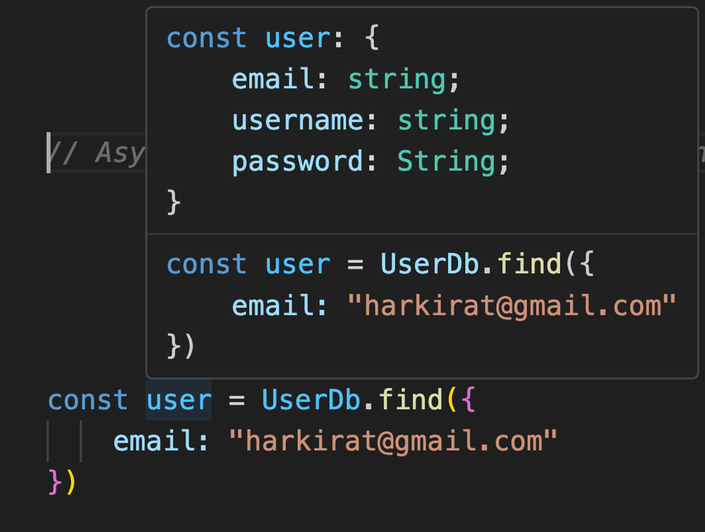

<ORMs>

  ORM=> Object-Relational Mapping

  Programming technique used in software development to convert data between incompatible type systems in object-oriented programming languages.

  ORMs are used to abstract the complexities of the underlying database into simpler, more easily managed objects within the code

  ORMs let you easily interact with your database without worrying too much about the underlying syntax
    eg => mongodb , sql

 <code in Non ORM>

 const query = 'SELECT * FROM epic Where email = $1';
 const value = ['gopalepic@gmail.com']
 const result = await client.query(query,value)

 <Code in ORM>

 User.find({
    email:'gopalepic@gmail.com'
 })

 <WHY USE ORMs>
    1) ORMS have basic syntax 
                example mentioned above where the user just have to write very basic code 

    2)Abstractions 
     
         * Don't need to worry about the underhood process
         * Writing query for one db , can be implemented to other databases as well 
          
          eg: User.finf({
            email:'gopalisepic@gmail.com'
          })

           This query can be implemeted in mongodb,SQL,Postgres...

        3) Type Safety

        It provides typesafety during development time

        4) Automatic migrations

        It stores all the quries performed by the user in a sequence 
 
  <eg> 
     In case of a simple Postgres app, it’s very hard to keep track of all the commands that were ran that led to the current schema of the table.

     But using an ORMs can solve this problem

     it stores all the quries performed by you

<Prisma>

  Pros of using prisma

   1) Data model
   2) Automated migrations 
    
    pirsma automatically made migrations possible, user don't have to worry about any looss of quries made by him.

    3) Type safety
     
     Prisma generates a type-safe databasr cliend based on the Primsa schema.

     you can see the below picture by crtl + click 

// 

   4) Auto-Completion

<Setup>

npm init -y

npm install prisma typescript ts-node @types/node --save-dev

npx tsc --init
Change `rootDit` to `src`
Change `outDir` to `dist`

npx prisma init

<Migration code >
 npx prisma migrate dev --name init

 

 <Prisma Quries>
 <CREATE TABLE>
 
 model User {
  id      Int      @id @default(autoincrement())
  email   String   @unique
  name    String?
  posts   Post[]
  profile Profile?
} 

<Make a prima Client>

        npx prisma generate

./src/index.ts

 
    async function quring(username:string,password:string , firstname:string , lastname : string){
     const res = await prisma.user.create({
         data:{
            username,
            password,
            firstname,
            lastname
         }
      })

      console.log(res);
    }

    quring('beEpic',
   '2344312234',
   'Gopal',
 'Soni)

 

 