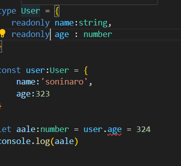

in my local computer , i have to run first 
npm i typescript 

then this commond runs 

To initilize an ts project 

npx tsc --init 

change directories in the tsconfig file 
{
	"rootDir": "./src",
	"outDir": "./dist"
}

1) <Pick TS PROPERTY>

eg we have an interface 

interface user {
    id:string,
    name:string ,
    age:number,
    email:string
}

and i don't want to change the values of name and email , but i wanted to change the valeus of the id and email

to do that 

interface user {
    id:string,
    name:string ,
    age:number,
    email:string
}

type selectiveFunctions = Pick< user ,'id'|'age'>

2) <Partial>

what if we want to optinally send few types but some not 

solution 

=> use <Partial>

interface user {
    id:string,
    name:string ,
    age:number,
    email:string
}

type selectedProps = Pick<user,'id'|'age'>

type optiallySendprops  = Partial<selectedProps>

now if you don't put some values like in selectedpropes , you did 't give values of the user id , the TS won't complain 

3) <readonly>

if you write ,

type User = {
    name:string,
    age : number 
}

const user:User = {
    name:'soninaro',
    age:323
}

let aale:number = user.age = 324
console.log(aale)
 
 your output will be 324 

 if we wanted to me the innet props of the type User to consts 

 we can write the User like this 

 
 
 type User = {
   readonly name:string,
   readonly age : number 
}

const user:User = {
    name:'soninaro',
    age:323
}

let aale:number = user.age = 324
console.log(aale)

this would give an error , means the age is now constant , you can not chagne it

<Record>

it make a Key value pair

we can make a key value pair in ts but is very ugly 

eg 

type Users = {
    name: string , 
    age : number
}

type Users = {[Key: string] : User}  

const users:Users = {
    'hey epic' : {id ,,, ... age ..},
    'hey epic' : {id ,,, ... age ..},

}

that pritty ugly code 

<good looking code >

interface epic{
    name:string,
    age : number 
}

type JustHard = Record<string : epic>

const users:JustHard {
    'sfdsdf': {name.. .. age}
    'sfdsdf': {name.. .. age}

}

<Map()>
just another way to keep key value pairs

const users = new Map()
users.set('bhaukaleki', {name:'hero',age:0,})
users.set('Jaidesi',{name:'jaishreeram' , age:44})

const user = users.get('Jaidesi')
console.log(user)

<Exlude>

type Event = 'click' | 'scroll' | 'mousemove';
type ExcludeEvent = Exclude<Event, 'scroll'>; // 'click' | 'mousemove'

const handleEvent = (event: ExcludeEvent) => {
  console.log(`Handling event: ${event}`);
};

handleEvent('click'); /